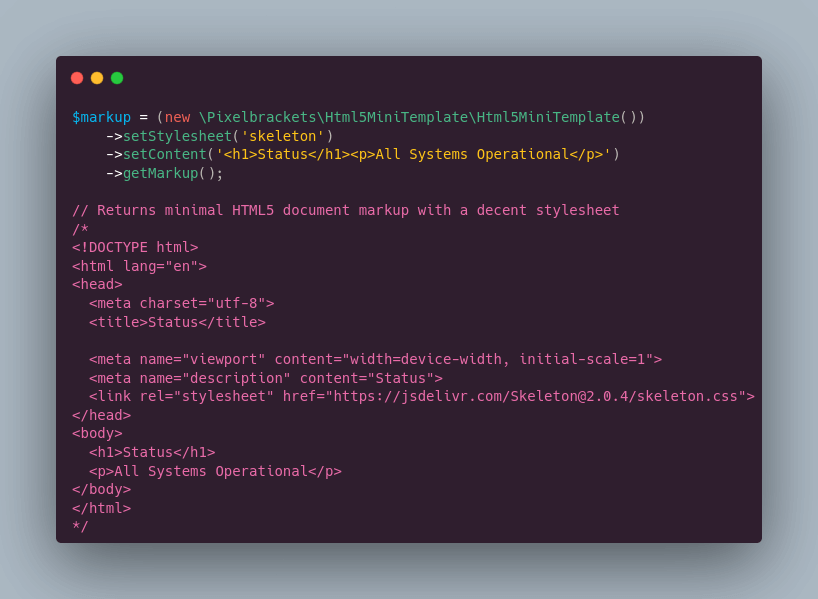

# HTML5 Mini Template

[](https://packagist.org/packages/pixelbrackets/html5-mini-template/)

The packages provides an HTML5 mini template for quick rendering of 
status pages, TOC pages, or any other minimal single-serving site.



## Requirements

* PHP

## Installation

Packagist Entry https://packagist.org/packages/pixelbrackets/html5-mini-template/

## Source

https://gitlab.com/pixelbrackets/html5-mini-template/

## Usage

1. Get the example template
   ```php
   $template = new \Pixelbrackets\Html5MiniTemplate\Html5MiniTemplate();
   echo $template->getMarkup();
   ```

1. Get template with custom content
   ```php
   $template = new \Pixelbrackets\Html5MiniTemplate\Html5MiniTemplate();
   $template->setContent('<h1>Status</h1><p>All Systems Operational</p>');
   echo $template->getMarkup();
   ```

## License

GNU General Public License version 2 or later

The GNU General Public License can be found at http://www.gnu.org/copyleft/gpl.html.

## Author

Dan Untenzu (<mail@pixelbrackets.de> / [@pixelbrackets](https://pixelbrackets.de))

## Changelog

See [./CHANGELOG.md](CHANGELOG.md)

## Contribution

This script is Open Source, so please use, patch, extend or fork it.
